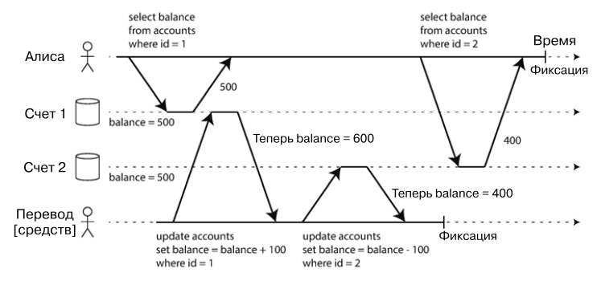
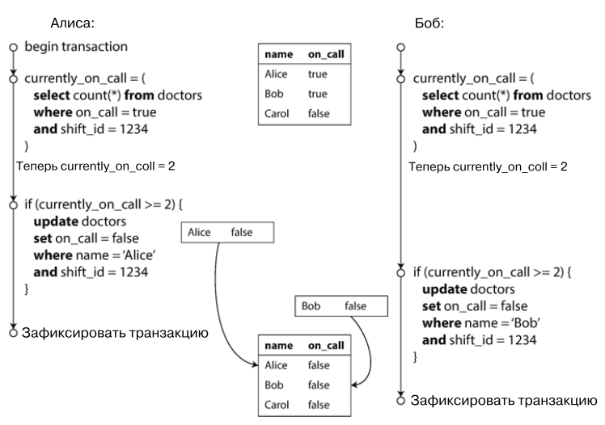

# Глава 7. Транзакции.

Транзакции - это слой абстракций, позволяющий приложению не замечать некоторые проблемы конкурентности и 
некоторые типы отказов аппаратного и программного обеспечения.

Транзакция - это способ, с помощью которого приложение группирует операции чтения и записи в одну логическую единицу;
всё множество операция, входящих в транзакцию, либо выполняется, либо откатывается.

## ACID.
Гарантии, предоставляемые транзакциями, часто описываются с помощью акронима ACID. Однако его можно интерпретировать
по-разному, и каждая СУБД даёт разные наборы гарантий, несмотря на провозглашение следованию ACID в документации.

### Атомарность.
Атомарность (`Atomicity`) в ACID означает способность СУБД отменить все операции, произведенные в рамках транзакции до той операции, 
которая завершилась ошибкой.

### Изоляция.
Целостность (`Consistency`) - свойство, описывающее гарантии СУБД, что все имеющиеся в БД инварианты после завершения транзакции 
будут выполненными. Однако на практике часто есть инварианты, верность которых обеспечивается приложением, а не СУБД. С этой точки 
зрения целостность не кажется свойством, которым должны обладать транзакции.

### Изоляция.
Изоляция (`Isolation`) как свойство ACID даёт гарантии того, что параллельно выполняемые транзакции не повлияют друг на друга и 
на данные, с которыми они работают.

### Долговечность.
Долговечность (`Durability`) - это гарантия того, что после успешного завершения транзакцииданные будут записаны на 
энергонезависимый носитель. Обычно это обеспечивается наличием журнала упреждающей записи (`write-ahead log`) для 
восстановления данных из него в случае сбоев. В распределённой БД долговечность означает, что данные были успешно скопированы на 
множество узлов.

## Слабые уровни изоляции.
Когда две параллельно выполняемые транзакции работают с одними и теми же данными, могут возникнуть условия гонки (`race conditions`). 
СУБД предоставляют различные уровни изоляции транзакции для предотвращения условий гонки. Самым надёжным является уровень `Serializable` 
(параллельные транзакции выполняются так, как если бы они выполнялись последовательно - serially). Однако обеспечение этого обычно уровня 
является дорогостоящим, поэтому часто применяются более слабые (но более дешёвые) уровни изоляции.

### Чтение зафиксированных данных (уровень `Read commited`).
Данный уровень гарантирует, что:
- при чтении транзакция видит только те данные, которые были зафиксированы (committed) другими транзакциями (то есть отсутствие 
`грязного чтения` -`dirty reads`);
- при записи транзакция перезаписывает лишь те данные, которые были зафиксированы другими транзакциями (то есть отсутствие `грязной записи` 
- `dirty writes`).

Чаще всего, предотвращение грязного чтения реализуется СУБД посредством блокировок на уровне записей: когда транзакция хочет внести 
изменение в объект (строку или документ), она должна сначала захватить блокироку на этом объекте. Все прочие транзакции, которые хотят внести
изменения на данном объекте, вынуждены ждать, когда захватившая блокировку транзакция выполнится (или закончится неудачей) и освободит 
блокировку.

Грязное чтение предотвращается путём запоминания значения данных на момент начала транзакции. Пока транзакция выполняется, все прочие 
транзакции видят запомненное значение.

### Повторяемое чтение.
Данный уровень изоляции гарантирует отсутствие такой аномалии, как `асимметрия чтения` (`read skew`), или `неповторяемое чтение` (`unrepeatable 
read`). 

*Пример асимметрии чтения:*

*Алиса производит чтение состояния баланса своих счетов в рамках одной транзакции, в то время как другая транзакция 
произвоит перевод средств с одного счёта на другой.*

Реализацией уровня изоляции `Повторяемое чтение` является подход `Изоляция снимков состояния` (`Snapshot isolation`).
Идея подхода состоит в том, чтобы каждая транзакция производила чтение данных из целостного снимка состояния БД, т.е. видела 
все данные, которые были зафиксированы в БД на момент начала этой транзакции.

Данный уровень изоляции предотвращает грязную запись с помощью блокировок, как и уровень `Чтение зафиксированныз данных`, но 
разрешает чтение без блокирования. Ключевой принцип изоляции снимков: читающие транзакции никогда не блокируют записывающие, а 
записывающие никогда не блокируют читающие.

Для реализации данного уровня изоляции СУБД сохраняет данные, зафиксированные разными трансляциями. Эта техника также носит 
название `Multi-version concurrency control (MVCC)`.

### Предотвращение потерянных обновлений.
Уровни изоляции `Чтение зафиксированных данных` и `Повторяемое чтение` дают гарантии насчёт того, какие данные 
видит читающая транзакция, параллельно с которой выполняются записывающие транзакции. При параллельных записывающих 
транзакциях могут возникать многие аномалии, наиболее известной из которых является аномалия `потерянных обновлений`.

Данная аномалия может иметь место, когда приложение производит чтение некоторого значения, затем изменяет его и производит 
запись нового значения. Если две транзакции выполняют эти действия параллельно, одно из изменений может быть потеряно.

Для предотвращения потери обновлений есть следующие решения:
- атомарные операции записи (пример: `UPDATE data SET value = value + 1 WHERE key = 'some_key'`);
- явное блокирование (пример: `SELECT FOR UPDATE`);
- автоматическое обнаружение потерянных обновлений СУБД;
- сравнение с обменом (пример: `UPDATE data SET value = 'new value' WHERE key = 'some_key' AND value = 'old value'`).

### Асимметрия записи.
Аномалия `ассиметрия записи` возникает тогда, когда две транзакции параллельно прочитывают одни те же значения, а затем обновляют 
одно или несколько из них.

*Пример асимметрии записи:*

*Алиса и Боб - дежурные врачи в клинике. На телефоне всегда должен оставаться как минимум один врач. Алиса и Боб оба чувствуют себя 
неважно и решают отпроситься со смены примерно одновременно друг с другом. Оба делают запрос на проверку количества врачей на текущей смене, 
а затем запрос на смену своего статуса.*

Решения:
- объявление ограничений (constraints), если СУБД поддерживает нужные;
- явная блокировка (например, `SELECT FOR UPDATE`), но это решение подходит не всегда;
- материализация конфликтов: создание таблицы с записями, по которым можно блокировать операции;
- уровень изоляции `Serializable`.

## Уровень изоляции `Serializable`.
Варианты реализации:
- непосредственно последовательное выполнение транзакций. Подходит в случаях, когда все транзакции - небольшие и быстрые;
- двухфазная блокировка: транзакция сначала должна захватить разделяемую (`shared lock`) или эксклюзивную блокировку 
(`exclusive lock`), затем выполнить операции и освободить захваченную блокировку. Читающие транзакции должны захватывать 
разделяемую блокировку, а пишущие - эксклюзивную. СУБД должны следить за появлением взаимных блокировок (`deadlocks`) и при 
обнаружении отменять одну из транзакций (а затем повторить её). Блокировки могут устанавливаться на основе предикатов или 
диапазонов значений;
- сериализуемая изоляция снимков состояния - оптимистичная техника контроля за параллельно выполняющимися транзакциями.
